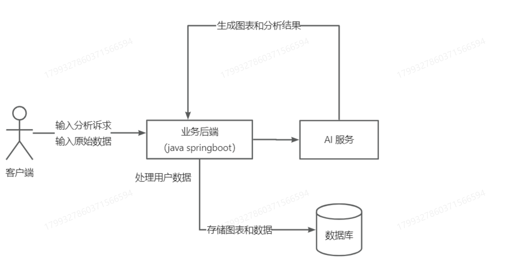

## 智能BI报表(后端)

### 项目介绍

为了生成可视化报表而建立的项目，主要让前端通过Echars展示数据，后端调用第三方AI接口对用户请求进行解析和生成前端代码格式实现智能生成。

### 技术选型

Spring Boot 2.7

MySQL 

MongoDB（TODO/ 尝试一下分表 利用MongoDB将图表数据 写入到这里）

MyBatis Plus

RabbitMQ

Easy Excel

Swageer + Knife4j

Hutool


### 架构图



### 流程一

#### 初始化项目

利用后端初始化模板(因为所有的系统都可能有用户登录注册功能 所以将这些功能写一个模板方便创建项目)

#### 数据库设计

创建Chart表(图表信息表) 并实现增删改查和分页

#### 分析需求

1. 用户输入的数据(分析目标、原始数据[文件]、选择类型(可选)、校验、成本控制)

#### 开发接口

1. 读取文件(利用Easy Excel)
2. 编写ExcelUtile工具类
3. 读取文件并分割出需要的数据 并过滤不需要的数据 最后拼接字符串 改造成可以输入的AI的数据
4. 编写测试类测试

### 流程二

#### 需求: 

1. 开发图表管理
2. 优化

#### 开发

1. 给需要调用的AI接口设置预设(为了达到回答精准)

2. 调用AI调用第三方接口(这里使用别人写好的AI和SDK)

   ```xml
   <!-- https://mvnrepository.com/artifact/com.yucongming/yucongming-java-sdk -->
   <dependency>
       <groupId>com.yucongming</groupId>
       <artifactId>yucongming-java-sdk</artifactId>
       <version>0.0.3</version>
   </dependency>
   ```

3. 实现图表管理接口将AI传递来的数据写入数据库中

4. 将AI返回的结果写入的一个新的VO里面 返回给前端

5. 测试

6. 从安全、数据存储、限流方便考虑优化系统

   1. 安全方面需要考虑文件的校验
      - 文件大小
      - 文件后缀
      - 内容(......)
      - tip: 一般文件100M时考虑分片
   2. 数据存储将表中的原始数据存入到另一张表中(这里能否使用另一个数据库 比如MangoDB 文档型数据库)这里分表是为了防止原始数据时过大对其他数据读取造成影响
      分出来的表利用chart_chart Id来存储方便区分

#### 限流

##### 介绍

限流是为了控制用户的调用次数，避免超支 这里列出两个方法

- 控制用户总调用次数
- 为了避免用户在一定时间内疯狂使用所以对接口做限流

##### 限流算法

- 固定窗口限流
- 滑动窗口限流
- **漏桶限流**
- **令牌桶限流**

##### 限流粒度

- 针对某个方法限流，即单位时间内最多允许同时 xx个操作使用这个方法
- 针对某个用户限流，比如单个用户单位时间内最多执行 XX 次操作
- 针对某个用户 x方法限流，比如单个用户单位时间内最多执行 XX 次这个方法

##### 本地限流

每个服务器单独限流 一般用在单体项目中

第三发库: Guava RateLimiter

##### 分布式限流

在多机部署时建议使用 利用Redisson内置的库 [Doc](https://github.com/redisson/redisson)

把用户的使用频率等数据放到一个集中的存储进行统计; 比如 Redis，这样无论用户的请求落到了哪台服务器，都以集中存储中的数据为准。

在网关集中进行限流和统计(比如 Sentinel、Spring Cloud Gateway)
